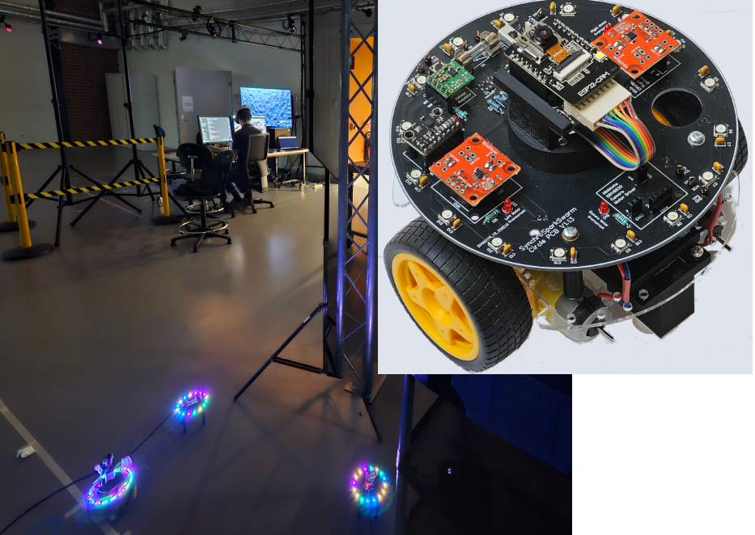
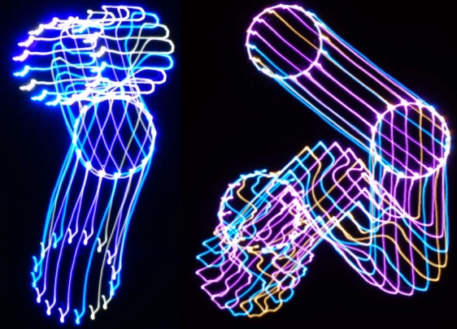
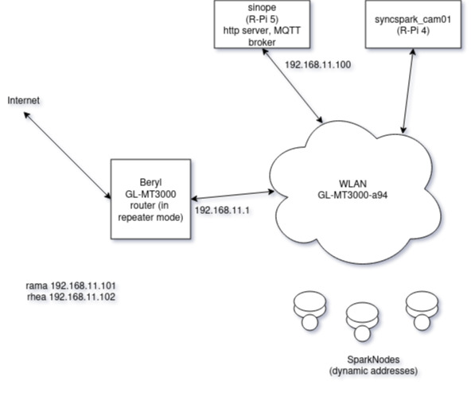
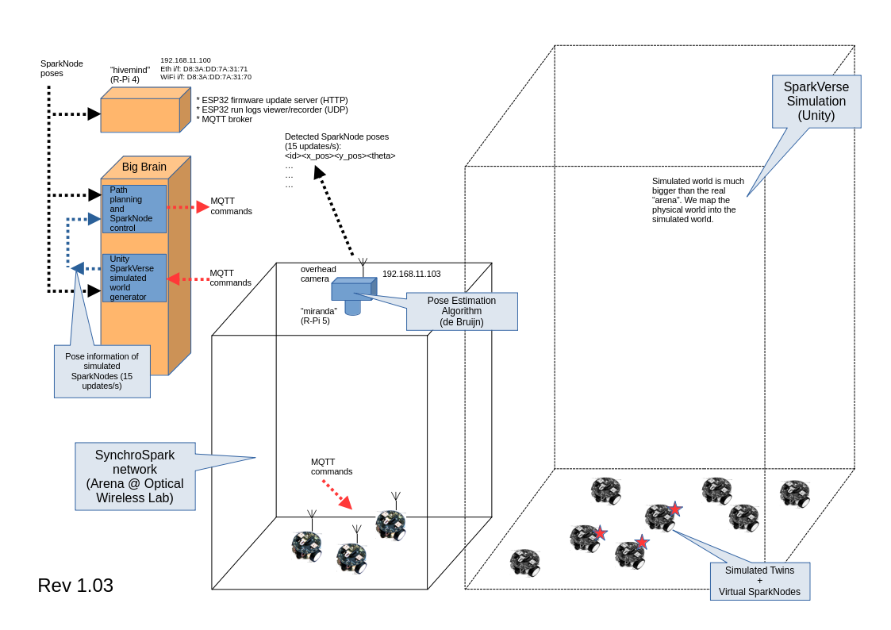

# SynchroSpark Swarm: Mobile Robots for Exploring Swarming, Synchronization, and Formation Control Algorithms

<p align="center">
  
</p>

## Table of Contents

- [Introduction](#introduction)
- [Project Objectives](#project-objectives)
  - [Formation Control Algorithms](#formation-control-algorithms)
  - [Research Collaboration](#research-collaboration)
- [Licensing](#licensing)
- [Project Structure and Terminology](#project-structure-and-terminology)
  - [About the Repository](#about-the-repository)
  - [AI Thinker ESP32-CAM Module](#ai-thinker-esp32-cam-module)
  - [Software Development Platform](#software-development-platform)
- [Testbed Configuration and Operation](#testbed-configuration-and-operation)
  - [Home Testbed (Beryl Router)](#home-testbed-beryl-router)
  - [Monash Robotics Lab Testbed](#monash-robotics-lab-testbed)
  - [Remote Control of SparkNodes with MQTT](#remote-control-of-sparknodes-with-mqtt)
- [Firmware Upgrades](#firmware-upgrades)
  - [Over-the-Air (OTA) Method for Firmware Upgrades](#over-the-air-ota-method-for-firmware-upgrades)
    - [OTA: One-Time Setup](#ota-one-time-setup)
    - [OTA: Typical Workflow](#ota-typical-workflow)
- [Programs for Testing and Demonstrating Various Functionalities](#programs-for-testing-and-demonstrating-various-functionalities)
  - [OTA Enabled Programs](#ota-enabled-programs)
  - [Directly Flashable Programs](#directly-flashable-programs)
- [Appendix A: Additional Steps to Create an ESP-IDF Project From Scratch](#appendix-a-additional-steps-to-create-an-esp-idf-project-from-scratch)
- [Appendix B: ESP32-CAM Configuration](#appendix-b-esp32-cam-configuration)
- [Appendix C: Custom Partition Table](#appendix-c-custom-partition-table)
- [Footnotes](#footnotes)

## Introduction

We[^1] are developing a network of low-cost mobile robots for exploring swarming,
synchronization, and formation control algorithms, hence the name
**SynchroSpark Swarm**. The project's short name is **SyncSpark**, which is
also the name of our main GitHub repository.

Each robot, called a **SparkNode**, features a wheeled base with two motors and
an ESP32-CAM AI-Thinker module. At present, the module is mounted in a fixed
position, but we plan to place it on a motorized rotating platform in a future
revision. That change will let us control the camera angle for 360-degree
observation and better support the study of fully localized algorithms.

## Project Objectives

When we started designing the SparkNodes, our goal was to experiment with cooperative robotics and explore the intersection of art and technology, with a particular focus on collaborative robot art. To support that goal, we wanted a mobile robot platform that was low-cost, compact, practical to build in quantities of 30 to 40 units, well connected, and easy to track at least at the level of relative pose.

These constraints shaped the project from the beginning. Because cost is a central concern, our robots do not rely on sophisticated sensors. Instead, we build on several low-cost localization strategies drawn from our past research, including:

- Using RGB LED rings and cameras, as described in [Partitioning de Bruijn
  Graphs Into k-cycles for Robot Identification and
  Tracking](https://sekerci.info/~ahmet/papers/de_bruijn_cycles.pdf) (T.
  Grubman, Y. A. Sekercioglu, and D. Wood), and
- Trilateration methods, as explored in
  [Accurate Node Localisation in Ad Hoc Networks Using Directional Pulsed
  Infrared Light
  Communications](https://sekerci.info/~ahmet/pgrad-projects/joseph-thesis.pdf)
  (J. Violi, MEngSc. Thesis).

The concepts developed in these studies provide the technical basis for implementing formation control algorithms on the swarm and, ultimately, creating coordinated dynamic art displays.

<p align="center">
  
</p>

<p align="center"><em>Long-exposure image of two SparkNodes moving randomly, illustrating the project's potential for collaborative robot art.</em></p>

### Formation Control Algorithms

Based on our past research in [formation control techniques](https://sekerci.info/~ahmet/networked_robotics/history.html), we believe that well-established decentralized algorithms are the right starting point for the platform. They allow us to study how simple local interaction rules can produce emergent collective behaviour. The [Boids algorithm](https://en.wikipedia.org/wiki/Boids) is a natural first example and will serve as our initial demonstration project.

Our second line of work is "Distributed Formation Control Using Computational Energy Minimization." This approach is inspired by our earlier work, [Virtual Localization for Mesh Network Routing](https://sekerci.info/~ahmet/mesh/virt_loc/) (N. Moore, Y. A. Sekercioglu, and G. K. Egan). In this approach, each robot moves toward a position that minimizes a local computational energy function, allowing formations to emerge without central coordination.

In our virtual localization study, static nodes iteratively estimated their positions by minimizing a local potential based on the virtual positions of their one-hop and two-hop neighbours, which were also computed iteratively. Although that idea was originally applied to sensor-network localization in support of geographic routing, the same principle can be adapted to mobile robots by translating virtual positions into real motion.

### Research Collaboration

The project has also expanded into a research collaboration with the [Shortest Path Lab (SPL)](https://pathfinding.ai) at Monash University, led by A/Prof Daniel Harabor. This collaboration focuses on building a mobile robot network for testing multi-agent pathfinding algorithms in realistic physical scenarios.

SPL works on AI planning and heuristic search algorithms for single-agent and multi-agent pathfinding problems, including trip planning in transportation networks, motion planning and navigation for mobile robots, and automated warehouse logistics. SyncSpark provides a practical testbed for moving some of those ideas out of simulation and into embodied multi-robot experiments.

As part of this collaboration, we also extended the project into the mixed-reality world by creating [SparkVerse](./docs/system/sparkverse.md), a virtual environment for testing algorithms before physical implementation. Together, the physical SparkNode platform and SparkVerse allow us to study these ideas across both simulated and real-world settings.

## Licensing

This repository contains both software and hardware design materials, so licensing is organized by content type.

- Software source code is licensed under the GNU General Public License v3. See [LICENSES/GPL-3.0.txt](./LICENSES/GPL-3.0.txt).
- Hardware design files under [docs/hardware](./docs/hardware) are licensed under the CERN Open Hardware Licence Version 2 - Strongly Reciprocal. See [docs/hardware/README.md](./docs/hardware/README.md) and [LICENSES/CERN-OHL-S-2.0.txt](./LICENSES/CERN-OHL-S-2.0.txt).

If a file or subdirectory carries a different license notice, that notice takes precedence for that material.

## Project Structure and Terminology

### About the Repository

This repository is organized as an umbrella project (or monorepo) containing
multiple ESP-IDF application projects and shared components:

- **Umbrella Project (Monorepo):** The top-level directory (`syncspark`) that
  contains several ESP-IDF application projects and common components.
- **Application Project (Subproject):** Each subdirectory under the umbrella
  (e.g., `sparknode_cam_wifi`, `sparknode_ota_updater`) that represents a standalone
  ESP-IDF project with its own `main` folder, `sdkconfig`, etc.
- **Component:** Shared code or libraries (e.g., in `components/`) that can be
  reused by multiple application projects.

Throughout this documentation, these terms are used to distinguish between the
overall repository, the individual ESP-IDF projects, and the reusable code
modules.

At a practical level, the top-level repository is centered around a small set of
directories:

- [components](./components/): shared ESP-IDF components reused across projects.
- [docs](./docs/): hardware, architecture, and supporting project documentation.
- [system](./system/): host-side utilities such as OTA packaging and log collection.
- [sparkcore](./sparkcore/): the primary OTA-enabled firmware for SparkNodes.
- [sparknode_ota_updater](./sparknode_ota_updater/README.md): the factory-partition OTA updater.
- [get_esp32_chip_info](./get_esp32_chip_info/README.md): the simplest direct-flash sanity check for a board/toolchain.

### AI Thinker ESP32-CAM Module

We use the AI Thinker ESP32-CAM module, which features the original dual-core
ESP32 chip (not the newer ESP32-S2, ESP32-S3, or ESP32-C3 variants). The module
provides WiFi and Bluetooth capabilities with the following specifications:
a 240 MHz clock speed, 520 KB RAM, 8 MB PSRAM (SPIRAM)[^2], and 4 MB flash memory.

### Software Development Platform

We use the [Espressif IoT Development
Framework (ESP-IDF)](https://github.com/espressif/esp-idf). [Visual Studio Code](https://code.visualstudio.com/), paired with the [ESP-IDF
extension](https://docs.espressif.com/projects/vscode-esp-idf-extension/en/latest/),
provides an excellent development environment.

To test the toolchain, we use a small program called
[`get_esp32_chip_info`](get_esp32_chip_info/README.md), which reports information
about the chip and its capabilities. This program should be flashed directly to the
factory partition via a USB cable.

## Testbed Configuration and Operation

### Home Testbed (Beryl Router)

<p align="center">
  
</p>

<p align="center"><em>The "portable" network configuration we use at home.</em></p>

### Monash Robotics Lab Testbed

<p align="center">
  
</p>

<p align="center"><em>The robot network setup we use in large-scale experiments. The diagram 
shows the Unity based simulation environment as well.</em></p>

### Remote Control of SparkNodes with MQTT

We are progressively adding MQTT commands for the remote control of SparkNodes. See
[the information and list of commands](./docs/software/mqtt.md) for details.

## Firmware Upgrades

We primarily use the over-the-air (OTA) method for firmware upgrades (see the
next section for details).

### Over-the-Air (OTA) Method for Firmware Upgrades

Our OTA firmware update method offers two main advantages:

1. It eliminates the need for USB cable connections, allowing us to quickly
   download firmware updates and get a SparkNode operational for testing.
2. Since we plan to have at least 30 SparkNodes in our SynchroSpark Swarm, the OTA
   method enables us to efficiently update firmware on all of them.

However, the OTA method requires a WiFi LAN, and directly flashing programs is
sometimes more useful for testing basic functionality. Therefore, we have grouped
our ESP-IDF projects into two categories:

- [OTA enabled programs](#ota-enabled-programs), and
- [Directly flashable programs](#directly-flashable-programs)

See [sparknode_ota_updater/README.md](sparknode_ota_updater/README.md) for
detailed information about our OTA firmware update scheme.

We provide the example application `sparknode_sample_ota_app`, which
demonstrates the basic operation of OTA-enabled firmware. When
`sparknode_ota_updater` is placed in the factory partition of the ESP32-CAM, all
other applications should be built using `sparknode_sample_ota_app` as a
starting point. These applications are designed to be delivered via OTA updates
and should not be flashed directly to the chip over USB.

#### OTA: One-Time Setup

Before generating any binaries, complete the following steps:

1. **Configure template files:** Locate
   [`wifi_credentials.h.template`](./components/syncspark_config/include/wifi_credentials.h.template)
   and
   [`network_config.h.template`](./components/syncspark_config/include/network_config.h.template)
   in the
   [`components/syncspark_config/include`](./components/syncspark_config/include/)
   directory, then follow these steps:
   1. **WiFi Connection**: Copy the contents of `wifi_credentials.h.template`
      to a new file named `wifi_credentials.h`[^3] and update the WiFi
      connection information as described in the file comments.
   2. **IP Address Configuration**: Copy the contents of
      `network_config.h.template` to a new file named `network_config.h`[^4]
      and update the IP addresses as described in the comments.
2. **Flash the OTA updater:** Flash `sparknode_ota_updater` directly over USB
   cable (**this will be placed in the _factory_ partition by default**), then
   disconnect the USB cable. Here are the **detailed flashing steps**
   (assuming the ESP-IDF toolchain is installed in `$HOME/esp`, version v5.5,
   and the SyncSpark repository is cloned to `$HOME/projects/syncspark`):
   1. Set up the environment: `source $HOME/esp/v5.5/esp-idf/export.sh`
   2. Navigate to the updater directory:
      `cd $HOME/projects/syncspark/sparknode_ota_updater`
   3. Configure the project: `idf.py reconfigure` (this command generates a
      `sdkconfig` from the `sdkconfig.defaults`).
   4. Build the binary: `idf.py build`
   5. Prepare the ESP32-CAM for flashing: Connect the ESP32-CAM to your
      computer via a USB cable. Press and hold the IO0 button, then press the
      ESP32-CAM reset button. Release the reset button first, then release the
      IO0 button. The chip is now ready for flashing.
   6. Flash and monitor: `idf.py flash monitor` (this command flashes the
      firmware to the factory partition).

The board is now ready for OTA updates. Disconnect the USB cable.

#### OTA: Typical Workflow

To generate a binary for an existing [SynchroSpark
program](#programs-for-testing-and-demonstrating-various-functionalities)[^5] in
the repository (for example, to run `sparknode_sample_ota_app` on a SparkNode
after cloning the SynchroSpark project sources to `$HOME/projects/syncspark`),
follow these steps:

1. **Activate the HTTP Server and Log Listener:**
   - Run the HTTP server on the target host (see the command in `network_config.h`)
   - Run [`log_listener.py`](./system/utilities/log_listener.py) on the
     listener host

2. **Set up the environment:**

   ```bash
   source $HOME/esp/v5.5/esp-idf/export.sh
   ```

   (Your ESP-IDF version may differ; please check your installation
   directory.)

3. **Navigate to the program's main directory:**

   ```bash
   cd $HOME/projects/syncspark/sparknode_sample_ota_app
   ```

4. **Add required dependencies:** Some projects require additional ESP-IDF
   standard components. For example, `sparknode_led_ring` needs the RGB LED
   strip component. To add it, run:

   ```bash
   idf.py add-dependency "espressif/led_strip^3.0.0"
   ```

   Please refer to each project's `README.md` for required system
   components.

5. **Configure the project:** Run:

   ```bash
   idf.py reconfigure
   ```

   to configure system parameters and set a custom partition table. For
   details, see [Appendix B: ESP32-CAM
   Configuration](#appendix-b-esp32-cam-configuration) and [Appendix C: Custom
   Partition Table](#appendix-c-custom-partition-table).

6. **Build the project:** Run:

   ```bash
   idf.py build
   ```

   in the top directory of the program (e.g.,
   `$HOME/projects/syncspark/sparknode_sample_ota_app`).

7. **Prepare the OTA binary:** Run:

   ```bash
   ../system/utilities/prep_ota_bin.sh <SparkNodeID>
   ```

   in the top directory of the program. Here, `<SparkNodeID>` is a number
   between 1 and 99 (we assign a `SparkNodeID` to each robot).

8. **Verify binary preparation:** Confirm that the `../system/ota` directory
   now contains the updated `*.bin`, `*.md5`, and the associated timestamp
   file.

9. **Reset the SparkNode:** Press the reset button on the SparkNode's
   ESP32-CAM.

To create a new ESP-IDF project from scratch, see [Appendix A: Additional Steps
to Create an ESP-IDF Project From
Scratch](#appendix-a-additional-steps-to-create-an-esp-idf-project-from-scratch).

## Programs for Testing and Demonstrating Various Functionalities

### OTA Enabled Programs

- **[`sparkcore`](sparkcore/)**: This is the main firmware we run on
  the SparkNodes.
- **[`sparknode_sample_ota_app`](sparknode_sample_ota_app/README.md)**: Used for
  testing and demonstrating the OTA firmware update method. It can serve as
  a starting point for new SyncSpark firmware.
- **[`sparknode_ledring`](sparknode_ledring/README.md)**: For testing the RGB LED
  ring control routines.
- **[`sparknode_mqtt`](sparknode_mqtt/README.md)**: For experimenting
  with MQTT. The `scripts` directory contains examples of
  SparkNode remote control.
- **[`sparknode_drive_test`](sparknode_drive_test/README.md)**: For testing the
  motor drivers.
- **[`sparknode_cam_wifi`](sparknode_cam_wifi/README.md)**: Demonstrates basic
  networking by periodically sending captured image frames to a remote host
  via UDP datagrams over WiFi.
- **[`sparknode_icm20948`](sparknode_icm20948/README.md)**: Performs sensor
  calibration and data acquisition using the ICM20948 9-axis IMU and BMP388
  barometric pressure sensors, and applies the Madgwick sensor fusion
  algorithm for accurate orientation estimation.
- **[`sparknode_i2c_test`](sparknode_i2c_test/README.md)**: For testing I2C
  communication with the motor controllers, BMP388 sensor, and GY-912 IMU board,
  and for verifying RGB LED ring operation.
- **[`sparknode_hall_sensors`](sparknode_hall_sensors/README.md)**: Tests the
  hall-effect sensor routines using interrupts.

### Directly Flashable Programs

- **[`get_esp32_chip_info`](get_esp32_chip_info/README.md)**: Reports on the
  configuration of the chip and performs quick checks.
- **[`sparknode_ota_updater`](sparknode_ota_updater/README.md)**: Flashed
  directly into the factory partition once to enable OTA firmware updates. It must
  remain resident in the factory partition for proper operation of OTA firmware
  updates.
- **[`glow_ledring`](glow_ledring/README.md)**: Illuminates the RGB LED ring
  with the assigned de Bruijn sequence (we allocate unique IDs to each
  SparkNode by using their base MAC addresses).
- **[`opti_pose`](opti_pose/README.md)**: Periodically captures images. We plan
  to use it to develop pose estimation algorithms that will run directly on the
  ESP32-CAM.

## Appendix A: Additional Steps to Create an ESP-IDF Project From Scratch

1. **Navigate to the main SyncSpark project directory:**

   ```bash
   cd $HOME/projects/syncspark/
   ```

2. **Create a new project:**

   ```bash
   idf.py create-project my_esp_project
   ```

   Replace `my_esp_project` with your desired project name. This command
   creates a directory named `my_esp_project` under the current directory and
   populates it with starter files and subdirectories.

3. **Set target:**

   ```bash
   cd my_esp_project && idf.py set-target esp32
   ```

   The ESP32-CAM uses the original ESP32 chip (ESP32-WROOM-32).

After creating your new project, follow the remaining steps outlined in the
[OTA: Typical Workflow](#ota-typical-workflow) section.

## Appendix B: ESP32-CAM Configuration

Before generating a binary to run on a SparkNode,
several ESP32 chip properties must be configured, and a
custom partition table must be established.
To accomplish this, we created an `sdkconfig.defaults` file.
Using this file, the toolchain configures the following
properties correctly:

- **Serial flasher config**: Increases the flash size to 4 MB.
- **Serial flasher config → Flash SPI speed**: Increases to 80 MHz.
- **Component config → ESP System Settings**: Increases the clock speed to 240
  MHz.
- **Component config → ESP PSRAM**: Enables support for PSRAM.
- **Component config → ESP PSRAM → Support for external, SPI connected RAM →
  SPI_RAM config → set RAM speed**: Sets to 80 MHz.
- **Partition Table → custom partition table CSV**: Selects this option and
  sets 0x8000 as the "Offset of partition table".

The standard `sdkconfig.defaults` file is located in the top-level directory of
the SynchroSpark project. Each individual ESP-IDF project's top directory
contains symbolic links pointing to it.

See [sdkconfig and configuration
management](docs/software/about_sdkconfig.md) for further details.

## Appendix C: Custom Partition Table

All OTA-enabled programs use a standard partition table, shown below. Each
OTA-enabled program's main directory contains a symbolic link to this standard
partition table.

```bash
    # SynchroSpark Project partition table
    # --> ESP-IDF requires partitions to be aligned to a 4 KB boundary
    # (multiples of 0x1000). In addition to this:
    # --> Partitions of type "app" have to be placed at offsets
    # aligned to 64 KB boundary (multiples of 0x10000).
    #
    # Name,   Type, SubType, Offset,  Size, Flags
    nvs,      data, nvs,     0x9000,  0x6000,
    phy_init, data, phy,     0xf000,  0x1000,
    factory,  app,  factory, 0x10000, 0xF8000,
    ota_data, data, ota,     0x108000,0x2000,
    ota_0,    app,  ota_0,   0x110000,0x2F0000
```

Note that the directly flashable programs use the built-in default partition
table.

[^1]: Ahmet Sekercioglu and Ismet Atalar, creators of the SyncSpark project.

[^2]: Unfortunately, the current version of ESP-IDF only allows us to use half of the available PSRAM capacity.

[^3]:
    To protect your WiFi credentials, `wifi_credentials.h` is included in
    `.gitignore` to prevent it from being uploaded to the GitHub project
    repository.

[^4]: The `network_config.h` file is not uploaded to the GitHub repository.

[^5]:
    Each program is a separate ESP-IDF project; therefore, the SynchroSpark
    repository contains multiple ESP-IDF projects.
